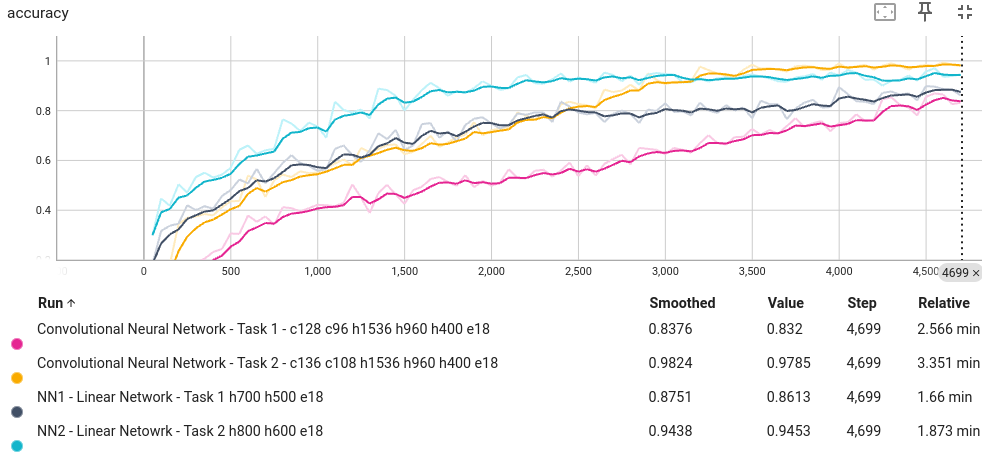
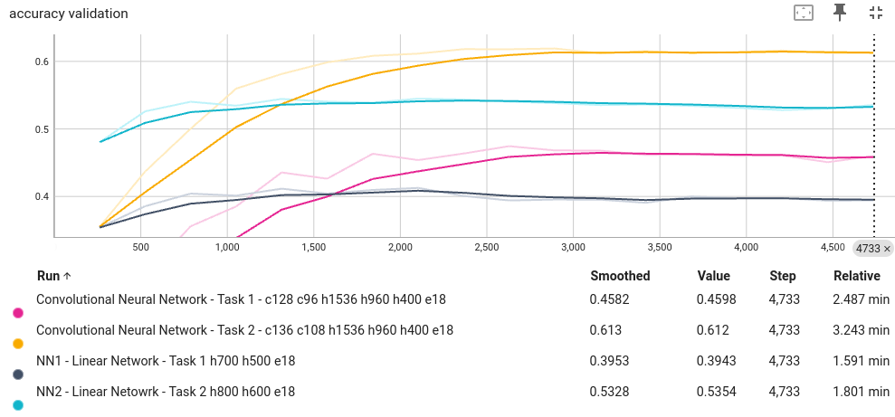
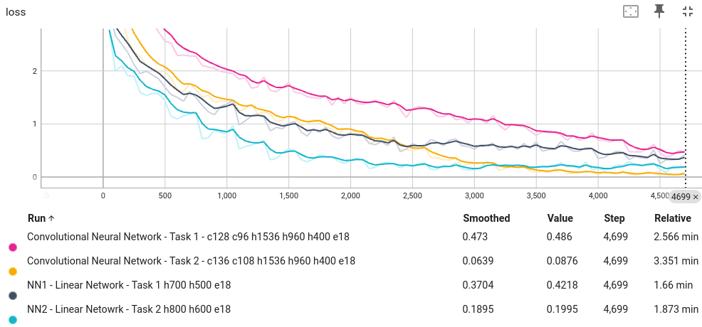
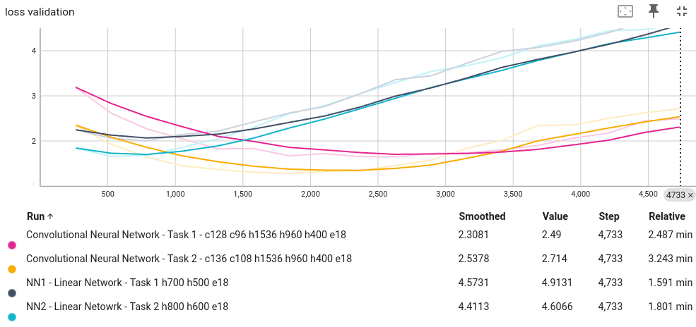

# Report: AI playing chess based on imitation learning

Source code:
https://github.com/python-wizard/chess_neural_networks

## Neural networks
nn1 or ccn1 or linear 1
Network deciding which piece to move

nn2 or ccn2 or linear 2
Network deciding where to move a piece indicated by network 1

## Key Files
* [cnn1_l.ipynb](./cnn1_l.ipynb) - Convolutional neural Netork model training notebook indicating which piece to move
* [cnn2_l.ipynb](./cnn2_l.ipynb) - Convolutional neural Netork model training notebook indicating where to move a piece indicated by network 1
* [linear1_l.ipynb](./linear1_l.ipynb) - Linear network with 2 hidden layers indicating which piece to move
* [linear2_l.ipynb](./linear2_l.ipynb) - Linear network model training notebook indicating where to move a piece indicated by network 1
* [linear1.ipynb](./linear1.ipynb) - Using nn linear network with 2 hidden layers indicating which piece to move

* [py_files/chess.py](./py_files/chess_specific_move.py) - Python script with functions used for data transformation from PGN game files to Numpy/Pytorch arrays.

* [transform_data_linear.ipynb](./transform_data_linear.ipynb) - Notebook showing transformation of data for linear networks (with smaller input)

* [transform_data_convolutional.ipynb](./transform_data_convolutional.ipynb) - Notebook showing transformation of data for convolutional networks (with bigger input)

* [chess_lib.ipynb](./chess_lib.ipynb) - learning and paying with Python-chess library

## Folders
* __py_files__ - python scripts used for data transformation
* __objects__ - storing python objects (dictionaries for parsing square numbers into 'a1' names of squares and vice versa)
* __pgn_files__ - folder with my downloaded games from lichess.com
* __np_arrays__ - (empty on github as files are too big) folder with numpy arrays (for linear networks) saved after data transormation for loading before training
* __python_pickles__ - python objects as pickles

### Introduction
I wanted to create chess AI using NN architecture to mimic the moves I would make at a given position based on my earlier games.

### Dataset

I have played chess since pre-teen years but since the pandemic I began playing online regularly. About that time I created an account on lichess.com. Luckily lichess runs on GNU AGPL3 Free Software license, is run by the community, saves all the games played on the site and makes them ready to be easily downloaded.

File lichess_…202402_02 consists of 6107 games played through the service.

I considered downloading games of all players (their games against other players) I played against throughout the years on the site, but after 24 hours of downloading I only got 425 player games (out of about 5700). The idea was to increase the dataset so that I would train the network on my games and on the games of players of similar rating but decided to avoid that. It would take a lot of time to download the games and significantly increase the time of training many times over. So I settled with training the nn with only my games.

Dataset of my own games is still big because each game consists of many positions. At the end, with only my games, and only positions where I was to make a move (black or white), after extracting the position in the array form I got a dataset with 134152 rows for training and 33538 rows of testing/validation data.

## Tools
### Pytorch, Lightning and Tensorboard
To train the networks I used the Pytorch Python library. At the beginning I used the nn package and later rewrote the training into Lightning which automates many things like usage of GPU, logging etc. For logging initially I used Wandb but later switched to Tensorboard.

### Python-chess
Python-chess is probably the best Python library for loading/saving chess PGN files, iterating through moves on loaded games, creating new board objects, validating moves, parsing squares in the classical form to a more computer understandable form (‘a1’ to 0). I used Python-chess mainly to extract data from PGN files. Later, after networks are already trained, I could validate moves predicted by network(s) using the library.

## Neural Network Architecture

Introduction to neural network architecture

There are two networks as part of the AI system. I call them NN1 and NN2. Given the structure of the board, castling possibility and player to move Nn1 is supposed to choose the square from which a piece is supposed to move. The other network, NN2 is given all the same input as NN1 adn  additional information that was output of the NN1, which specificaly is the origin square from where to move from. NN2 is supposed to output where to move. NN1 decides what piece to move (since one piece occupies one square) and NN2 decides where to move. Initially I experimented with using a linear network with 2 or 3 hidden layers with various activation functions and later used a convolutional neural network (CNN1 and CNN2).

### Preparing the data for neural network
Presenting the board to a neural network is a tricky issue. After reading a lot of articles about it I decided to do the following:
First I present arrays representing each piece for each color. Each array has a shape of 8x8 (like a chessboard). Location 0 in the array represents a1 square and 63 represents h8. Example array indicating location of white pawns:

        tensor([[0., 0., 0., 0., 0., 0., 0., 0.],
                [1., 1., 0., 0., 0., 1., 1., 1.],
                [0., 0., 0., 0., 0., 0., 0., 0.],
                [0., 0., 0., 0., 0., 0., 0., 0.],
                [0., 0., 0., 1., 0., 0., 0., 0.],
                [0., 0., 0., 0., 0., 0., 0., 0.],
                [0., 0., 0., 0., 0., 0., 0., 0.],
                [0., 0., 0., 0., 0., 0., 0., 0.]])  
 
There are 5 arrays for white (each piece) and 5 arrays for black pieces. 1 represents the existence of a piece at a given position. Another array represents the location of en passant square (can only be done immediately after double pawn move by opposite player), so it can’t be deduced from how the board looks. With the linear networks, after flattening all the arrays I extended it by length 4 for ability for castle for each player on each side (2 colors x 2 castle options) and extended by 1 to indicate what color is to make a move. We end up with 837 input nodes.

Later when I tried with convolutional neural networks I had to extend the input and 4 castling neurons were converted to 4 x (8x8) arrays and another 1 x (8x8) array indicating which color is to make a move. So 5 positions in an array were extended into their own 8x8 arrays each.

Initially I used Numpy when creating and stacking arrays. Later on I converted them to tensors and saved them to files for future use.

### Neural network architecture
For simplification I experimented with 4 neural networks. 2 linear and 2 using convolutional layers. Each pair is used so that one network is supposed to indicate the piece to move (from what square to move strictly speaking) and the other what square to move to. Linear networks and convolutional networks are two approaches for the same problem. First I tried with linear networks and later with convolutional.

#### Linear networks:
NN1 has input of: 12 arrays x 8x8 for each piece of each color, 1 8x8 array for en passant square + 4 castling ability + 1 for move (white or black to move).
Output has 64 neurons indicating the square to move from.

NN2 has the input of an additional 8x8 board to indicate the origin, where to move from, square.
Output has 64 + promotion square at each side (8 x 2) + each piece pawn can promote to (Rook, Knight, Bishop, Queen) x 4. Ends up to be 64 + 16x4 = 128.

I experimented with different activation functions (relu, tanh) but relu seems to work best. Learning rate of about 0.005 seems to work best.

#### Convolutional networks
CNN1 has input of 18 boards of size (8 x 8) . 12 for location of pieces, 1 for en passant square, 4 for castling possibility and 1 indicating side to move. Ends up to be 64x18 = 1152. So which color is to move is indicated by a whole 8x8 array. Whole 8x8 array is 0 if it is white to move and 1 if it is black to move.

Output of CNN is the same as NN1.

CNN2 has input of 19 boards x 8 x 8. Like CNN1 with one additional for in origin to move from square.

Output of CNN2 is the same as NN2.

For both CNN networks initially I used a network proposed in the first article in the sources:

The architecture I picked was two 128-convolutional layers with 2x2 filters followed by two 1024-neuron fully connected layers. I didn’t apply any pooling because pooling provides location invariance. A cat on the top left of an image is just as much of a cat as if the cat was on the bottom right of an image. However, for chess, a king pawn’s value is quite different from a rook pawn. My activation function for the hidden layers was RELU while I applied softmax to the final layer so I would essentially get a probability distribution where the sum of the probabilities of all squares added up to 100%.

But with experimentation I realized that second convolutional layer with 96 kernels and 3 linear layers of 1536, 960 and 400 afterwards seem to work a little better.

## Charts:

Accuracies (training & validation) seem to plateau. Overfitting doesn’t seem to affect accuracy, including validation accuracy. CNN1 plateaus around epoch 23 reaching around 0.95. CNN2 plateaus around epoch 16 with accuracy around 0.97.

In general networks deciding where to move (NN2 & CNN2) reach higher training accuracy, validation accuracy, lower loss and lower validation loss.

For validation accuracy CNN1 plateaus around epoch 10 with value of 0.47. In case of CNN2 it plateaus around 0.61 around epoch 8.

Loss for all networks seems to steadily go down with training. Validation loss the lowest loss for CNN1 is around epoch 3 with value of 1.648 and for CNN2 around epoch 6 with value of 1.279.

s

Results:
In general convolutional networks perform better than Linear. Also networks associated with the second task (choosing where to go; NN2 & CNN2) perform better than networks associated with the first task. Networks associated with the fist task have 64 output neurons and those associated with the second task have 128 output neurons. So in theory accuracy should work better for networks used in the first task as there are less categories for classification. But it is the opposite and it also has to be noted that a lot of classes in the networks associated with the second task are very rare (have very low probability) like a pawn promoting to a knight at a specific square or just promotions in general. 

Using NNS
I tried playing against the AI. I do it by passing a new board to the model with no_grad parameter.
Out of the distribution of squares from NN1 or CNN1 I get the distribution of probabilities and choose the best move. Using the chess library I check whether the move is legal (or rather whether the square network indicates there is a piece there and whether it has a legal move). Then I pass it to the second network and check whether the move is legal. If it is not I go back and choose the second best move and so on. On a basic lever the NN seems to choose squares with the right color (plays right side). Also it seems to make more legal moves then illegal moves.

Source code:
Source code for the project can be found at, along with the description what each file does:
https://github.com/python-wizard/chess_neural_networks

Sources:
Predicting Professional Players’ Chess Moves with Deep Learning
https://towardsdatascience.com/predicting-professional-players-chess-moves-with-deep-learning-9de6e305109e

Predicting Moves in Chess using Convolutional Neural Networks
http://vision.stanford.edu/teaching/cs231n/reports/2015/pdfs/ConvChess.pdf

Mastering Chess and Shogi by Self-Play with a General Reinforcement Learning Algorithm
https://arxiv.org/pdf/1712.01815.pdf

Neural Networks for Chess. The magic of deep and reinforcement learning revealed
Dominik Klein
https://github.com/asdfjkl/neural_network_chess/releases

Understanding AlphaZero: A Basic Chess Neural Network
https://www.chess.com/blog/the_real_greco/understanding-alphazero-a-basic-chess-neural-network

